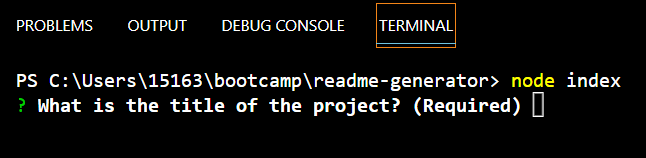
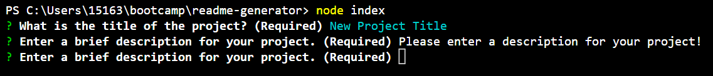
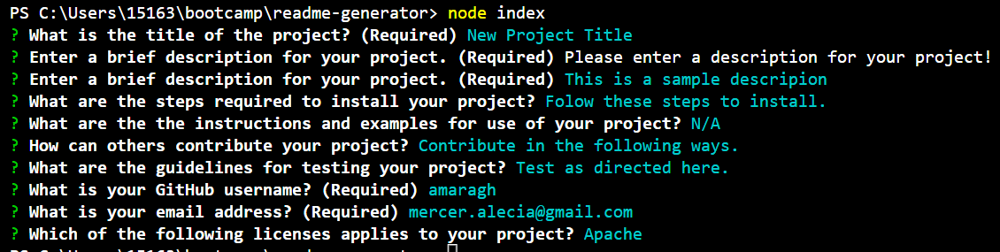
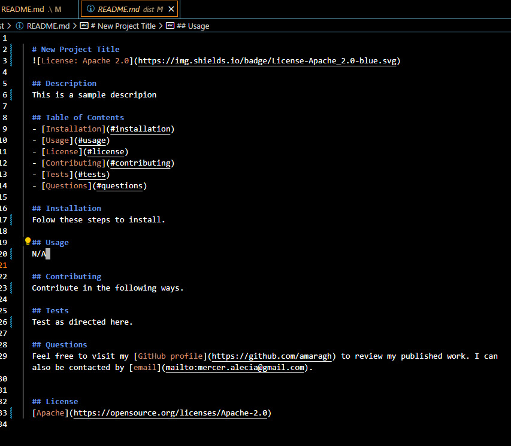
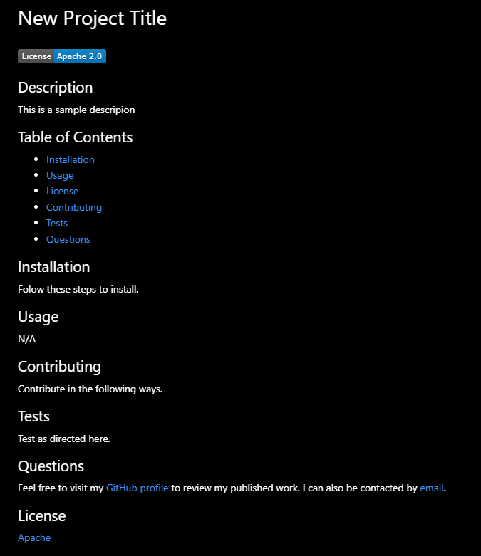

# README Generator 

## Description

A high-quality README file is essential to any open source project, and provides significant value to any users and potential contributors. By allowing the project creator to leverage a command-line application to generate a README file for the project, they can work more efficiently, as they can now spend more time on the technical details of the project.

Moving into the second phase of this bootcamp, I am able to apply my newly acquired skills with Node.js to create such a command-line application. This was an interesting challenging in working with asynchronous functions, using Node.js to generate Markdown and then a `.md` file.

## Installation

Clone the repo, then from the command line, run `npm install` in the project's root directory to download any dependencies.

## Usage

The demo recording can be found [here](https://youtu.be/5PoZYLOz7u8).

To invoke and use the application from the command line, please follow the below steps:
1. From the command line, navigate to project root directory. 
2. Run the command `node index`.

3. Answer each of the prompts as directed.
   - For required fields, a validation message will appear if nothing is entered.
   
   - The answers promptd will appear similar to the below once complete.
   
4. Once all prompts are exhausted, navigate to the `dist` folder in the repository to view your generated README file. 
   - The file will appear in the markdown format
   
   - A preview of the file can also be viewed. A badge for the chosen license will appear near the top of the README.
   

## License

Please see repo for license information.